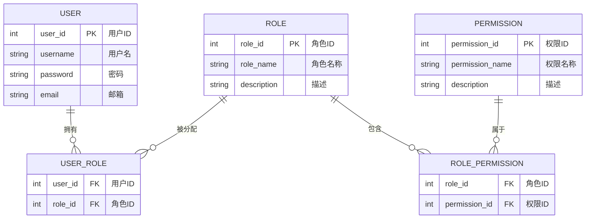

大概思路流程

先介绍登录认证历史，如多端登录到单点登录的发展，各自的优劣

介绍正常单点登录的实现流程

介绍对接第三方平台登录的流程，如github

介绍实现auth2.0授权码认证，并提供给第三方应用作为sso服务的实现流程

```mermaid
erDiagram
    USER {
         int user_id PK "用户ID"
         string username "用户名"
         string password "密码"
         string email "邮箱"
    }
    ROLE {
         int role_id PK "角色ID"
         string role_name "角色名称"
         string description "描述"
    }
    PERMISSION {
         int permission_id PK "权限ID"
         string permission_name "权限名称"
         string description "描述"
    }
    USER_ROLE {
         int user_id FK "用户ID"
         int role_id FK "角色ID"
    }
    ROLE_PERMISSION {
         int role_id FK "角色ID"
         int permission_id FK "权限ID"
    }
    USER ||--o{ USER_ROLE : "拥有"
    ROLE ||--o{ USER_ROLE : "被分配"
    ROLE ||--o{ ROLE_PERMISSION : "包含"
    PERMISSION ||--o{ ROLE_PERMISSION : "属于"

```

